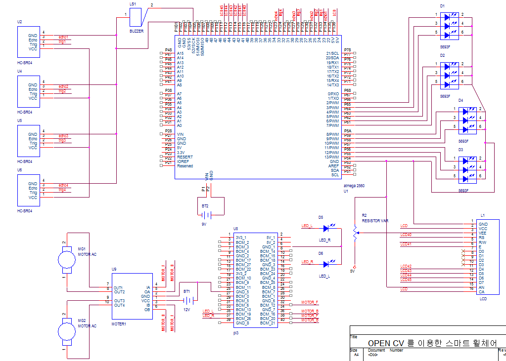

# Smart Wheelchair (We are all the same driver) 
몸이 불편하다 해서 운전이 다른것이 아닙니다. Open CV를 이용해 눈과 손으로 운전하는 스마트 휠체어 입니다. 

------------------------------------------------------
# 기능의 간략한 설명
1. 손의 움직임에 따라 휠체어를 운전  
2. 눈의 움직임에 따라 휠체어의 비상등 on/off
3. 사방에 물체가 가까이 있을 때 거리에 따라 led가 켜짐
4. 후방에 물체가 가까이 있을 때 거리에 따라 부저가 울림

# 개발 기간
- 2021.01.15 ~ 2021.02.20 

# 사진

# 회로도

# block diagram

# 동작 영상

